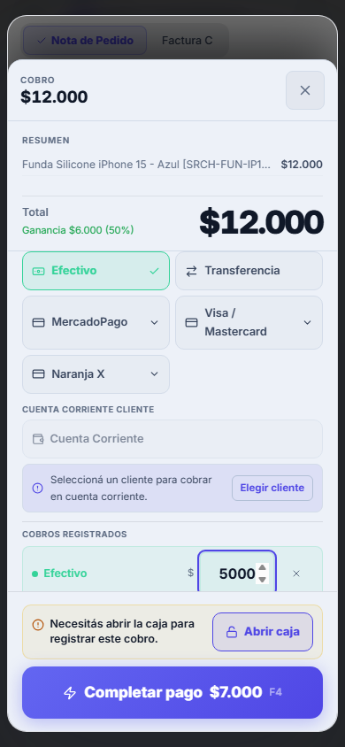
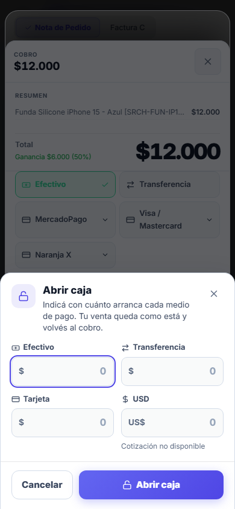
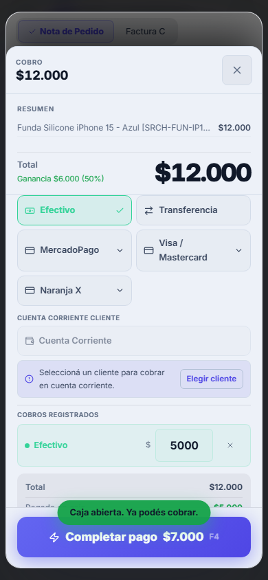
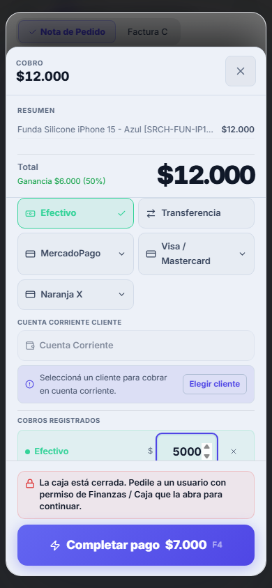
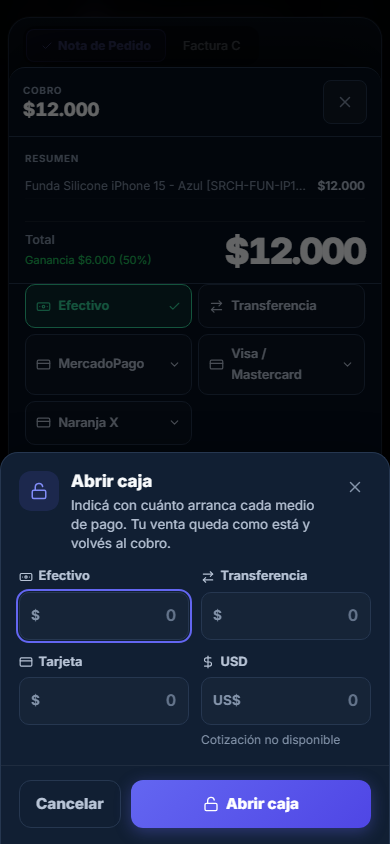
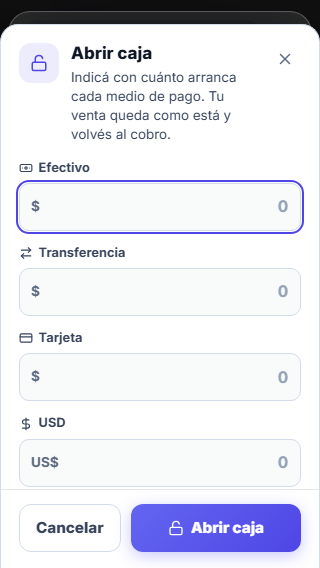
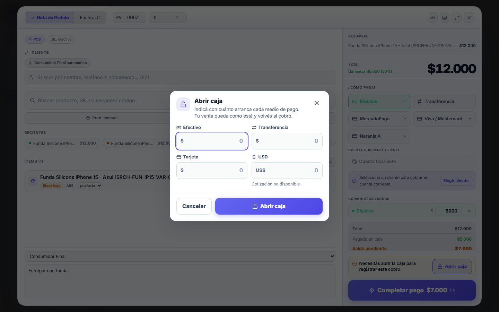

# BETA-UX-1B — Primer cobro sin callejón sin salida

Cierra **P0-2** del discovery BETA-UX-1 (`beta-ux-1-discovery.md`): el POS frenaba el cobro por caja
cerrada sin ofrecer cómo abrirla.

Frontend + tests. **Sin migraciones, sin `db push`, sin deploy, sin cambios en producción.** La
autoridad server-side que este flujo necesita ya existía (§6); el lote la dejó probada y atada al
repo, no la creó.

---

## 1. Problema

El flujo canónico de cobro es `ComprobanteProModal`. Exige una caja abierta para registrar un cobro,
y lo comunicaba así:

| Dónde | Qué veía el usuario |
|---|---|
| Footer del panel de cobro | «Caja cerrada — no se pueden emitir comprobantes» (aviso pasivo, sin acción) |
| Al tocar **Cobrar** | «No hay caja abierta. Abrí caja antes de emitir.» |

El día 1 la caja **siempre** está cerrada. Un owner que hizo registro → negocio → cliente → orden →
reparación → cobrar se enteraba recién ahí de que tenía que salir del POS, encontrar Caja (que no
está en la barra inferior del celular), abrirla, volver y rearmar la venta.

## 2. Flujo nuevo

Cuando el POS necesita registrar un cobro y la caja está cerrada (`!cajaIsOpen && !skipFinanceEntry`):

| Actor | Footer del cobro | Al tocar **Cobrar** (o F4) |
|---|---|---|
| Con `finance` (`canUseCaja`) | «Necesitás abrir la caja para registrar este cobro.» + botón **Abrir caja** | Se abre el diálogo **Abrir caja** encima del POS. El checkout **no empieza** |
| Sin `finance` | «La caja está cerrada. Pedile a un usuario con permiso de Finanzas / Caja que la abra para continuar.» Sin botón ni enlace | El aviso se sacude. No hay diálogo, ni llamada al servidor, ni navegación |

El diálogo pide el saldo inicial de **Efectivo, Transferencia, Tarjeta y USD**, y muestra la
cotización que el POS ya tiene cargada (`exchangeRate`). Si el POS no tiene cotización, dice
«Cotización no disponible» en vez de mostrar «$1».

Al abrir correctamente:

1. se refresca `CajaContext` (`refresh()`);
2. se emite `cash-session-updated` (mismo evento que la pantalla Caja);
3. se cierra **sólo** el diálogo;
4. el usuario queda en el mismo checkout, con un aviso «Caja abierta. Ya podés cobrar.»

**Abrir la caja nunca cobra.** El cobro sigue necesitando que el usuario toque **Cobrar**. «Volver al
cobro» significa volver al checkout intacto, no ejecutar la transacción.

Capturas (stack local real, `docs/beta-ux-1/evidence-1b/`):

| 390 px · caja cerrada | 390 px · diálogo | 390 px · de vuelta |
|---|---|---|
|  |  |  |

| 390 px · sin permiso | 390 px · oscuro | 320 px |
|---|---|---|
|  |  |  |

Desktop 1440: 

## 3. Permisos

La autoridad de UI es **una sola**: `canUseCaja` de `src/contexts/CajaContext.tsx`
(`canUseCaja = can('finance')`). No se mira ningún rol; los overrides individuales siguen valiendo.

Son dos preguntas distintas, y el contrato previo (P0-P6) las separa a propósito:

| Pregunta | Capacidad |
|---|---|
| ¿Puede **operar** la caja (abrir / cerrar)? | `finance` |
| ¿Puede **conocer** qué caja está abierta? | `finance` **o** `comprobantes` |

Un `sales` tiene `comprobantes` y no `finance`: sigue viendo la caja activa y vendiendo atado a ella
(`caja_id`), pero no puede abrirla. Con la caja cerrada ve la explicación, sin acción.

| Actor | Default `finance` | Desde el POS |
|---|---|---|
| owner, admin, cashier | sí | Abrir caja |
| manager, tech, sales, viewer | no | Sólo la explicación |
| cualquiera con override `finance: true` | sí | Abrir caja |
| cualquiera con override `finance: false` | no | Sólo la explicación |

El diálogo además se defiende solo: sin `canUseCaja` no se renderiza aunque se lo monte con
`isOpen`, y `handleSubmit` no llama a nada.

## 4. El checkout se conserva

P0 del lote. Abrir o cerrar el diálogo no puede resetear nada de la venta.

Cómo está garantizado, por construcción:

- El diálogo es **un hijo de `.cpm-root`**. No desmonta el POS, no navega (`navigate('/caja')` no
  existe en este flujo) y no cierra `ComprobanteProModal`.
- Todo su estado en el POS es `showOpenCaja` (un booleano). No toca `lineas`, `pagos`, `clienteId`,
  `orderId`, `observaciones`, tipo, punto de venta, borrador ni la key de idempotencia del cobro.
- El prerequisito corta `handleSubmit` **antes** de `getOrCreateIdempotencyKey` y de
  `comprobanteService.crear`: con la caja cerrada no existe key del intento, ni comprobante, ni
  pago, ni movimiento de stock, ni pedido a ARCA.

Dos protecciones contra cobrar sin querer:

- **Ventana de 800 ms** (`CAJA_OPENED_COBRAR_GUARD_MS`). En el teléfono el botón «Abrir caja» del
  diálogo queda en el mismo lugar de la pantalla que «Cobrar»: un doble toque para abrir la caja
  caería sobre «Cobrar». Durante esa ventana `handleSubmit` ignora activaciones.
- **El foco vuelve al bloque de cobro, no al botón.** Un Enter sostenido desde el diálogo no puede
  activar «Cobrar» ni el «Enter inteligente» del buscador.

Con el diálogo a la vista los atajos del POS no corren (Escape cierra sólo el diálogo; F4 no cobra
por debajo; F2 no le roba el foco).

## 5. RPC e idempotencia

`src/services/cashSessionService.ts` es un adaptador de **`open_cash_session_atomic`**, con el mismo
contrato de argumentos que `CajaPage.handleOpenCaja` (que no se modificó):

```
p_business_id, p_user_id,
p_efectivo, p_transferencia, p_tarjeta, p_usd,   -- saldos iniciales; USD en dólares
p_usd_rate,                                       -- exchangeRate del POS
p_idempotency_key
```

- No inserta en `cajas`, no calcula saldos, no decide permisos.
- Abrir caja **no crea movimientos financieros** (ni FM ni BFE): sólo deja el saldo inicial de la
  sesión. Medido en la matriz SQL (§7).
- **Idempotencia**: `resolvePurchaseKey` (`src/utils/purchaseIdempotency.ts`), igual que Caja. La key
  se conserva mientras no cambien los montos (doble toque, reintento tras un timeout) y se renueva
  si cambian. Cada apertura del diálogo es un intento nuevo. Tras `IDEMPOTENCY_CONFLICT` se descarta.
- Un doble toque en «Abrir caja» manda **una** llamada (ref anti-doble-submit + botón deshabilitado).

Traducción de la respuesta a tres resultados:

| Respuesta del servidor | Resultado | UI |
|---|---|---|
| `{ ok:true }` | `opened` | refresh + evento + vuelve al checkout |
| `{ ok:false, error:'Ya hay una caja abierta' }` | `already_open` | carrera (abajo) |
| `42501 FORBIDDEN` (levantado por el wrapper) | `error` / `FORBIDDEN` | queda en el diálogo: «Tu usuario no tiene permiso para esta operación financiera.» |
| cualquier otro | `error` | queda en el diálogo, texto de `financeErrorMessage` |

Los errores pasan por `src/lib/financeErrors.ts`. Una caída de red o un error con SQL adentro no
llegan crudos a la pantalla; el detalle va al `logger`, sin datos del pedido.

### Carrera: otro usuario abre la caja

A ve la caja cerrada y abre el diálogo; B abre la caja; A confirma. El servidor responde «Ya hay una
caja abierta». El POS refresca `CajaContext` y, **si efectivamente aparece una caja abierta**, da el
prerequisito por cumplido: cierra el diálogo y vuelve al checkout con «La caja ya estaba abierta. Ya
podés cobrar.» (los saldos que tipeó A no se aplicaron, y el texto lo dice).

- Si el servidor dice «abierta» pero la relectura no la muestra, **no** se da por resuelto: queda en
  el diálogo con un error.
- Si la caja aparece abierta mientras el diálogo está a la vista (otra pestaña, el refresh al volver
  el foco), el diálogo se retira solo.
- Un replay del servidor sobre una caja que ya se cerró no se presenta como «caja abierta».
- Ningún otro error se trata como carrera.

Para poder decidir en el mismo paso, `CajaContext.refresh()` ahora **devuelve** la caja que leyó
(`Promise<ActiveCaja | null>`, antes `Promise<void>`). Es la misma lectura, no una segunda fuente.

## 6. Discovery de autoridad server-side

Pregunta que había que responder antes de cerrar el lote: **¿la definición efectiva de
`open_cash_session_atomic` exige `finance`, o cualquier miembro puede abrir la caja?**

| Migración | Qué hace con la RPC |
|---|---|
| `20260706130000_m6_cash_sessions.sql` | La crea. Valida sesión + pertenencia al negocio. **No** mira `finance` |
| `20260713310000_m7_7c1a_…` | Sólo `SET search_path` |
| `20260827120000_p0p6_cajas_capability.sql` | Declara el contrato (operar = `finance`) y endurece la **lectura** de `cajas`. No toca la RPC |
| **`20260908120000_lote3_secdef_action_authority.sql`** | Mueve la implementación a `private` y publica un **wrapper** que llama a `private.require_action_authority(p_business_id, 'finance', …)` **antes** de delegar |
| `20260909120000_lote3_phase_b_…` | Redefine el gate: sin autoridad levanta `FORBIDDEN` (`42501`); la decisión es `current_user_can(p_capability)` |
| posteriores | Ninguna vuelve a mencionar `open_cash_session_atomic` ni `close_cash_session_atomic` |

**Conclusión: la definición efectiva exige `finance`. La de julio no es la vigente. Este lote no
necesita migración.** `close_cash_session_atomic` está en el mismo mapa de Lote 3, con la misma
capacidad: no conserva la brecha histórica.

Evidencia, de más débil a más fuerte:

1. **Fuente** — el mapa de Lote 3 y ninguna redefinición posterior (`betaUx1bServerAuthority.test.ts`).
2. **Producción, sin tocarla** — el snapshot versionado `docs/security-sec08f/production-catalog.json`
   registra el `md5(prosrc)` de `public.open_cash_session_atomic` = `a2371261b50c260b1ae06cc7f3427d9d`
   y de `close_…` = `0a57bb81ec5f5bdaa2e62c3fb03e0a8b`. Son **exactamente** el hash del cuerpo del
   wrapper gateado, reconstruido desde la plantilla de la migración. El test lo recalcula.
3. **Replay limpio** — un stack local levantado de cero con las 285 migraciones de `main` deja el
   mismo hash en `public` y la implementación en `private` sin `EXECUTE` para `authenticated`.
4. **PostgreSQL real** — `tests/sql/beta_ux_1b_cash_session_authority.test.sql`: la RPC decide lo que
   decide `current_user_can('finance')` para 11 actores, deniega con `42501 FORBIDDEN` y cero
   efectos, y trae un **control negativo** (sin el gate, un `sales` sí abre la caja).
5. **De punta a punta** — `tests/e2e/m7/pos-open-caja.spec.ts`: con un perfil `sales`, la app no
   ofrece la acción y un pedido armado a mano con su JWT recibe **403 `FORBIDDEN`** de PostgREST sin
   abrir nada; el mismo pedido pasa cuando el actor recupera `finance`.

Verificación read-only opcional en producción (no forma parte del rollout):

```sql
select p.proname, md5(p.prosrc) as body_md5, p.proconfig,
       has_function_privilege('anon', p.oid, 'EXECUTE') as anon_exec
  from pg_proc p join pg_namespace n on n.oid = p.pronamespace
 where n.nspname = 'public'
   and p.proname in ('open_cash_session_atomic', 'close_cash_session_atomic');
-- esperado: a2371261b50c260b1ae06cc7f3427d9d / 0a57bb81ec5f5bdaa2e62c3fb03e0a8b, anon_exec = false
```

## 7. Tests

| Suite | Qué mide |
|---|---|
| `tests/components/betaUx1bFirstCheckout.test.tsx` (37) | POS **real** con los providers reales de sesión y caja (la capacidad sale de `usePermissions`). Los 8 puntos del contrato + regresión: caja abierta, `skipFinanceEntry`, matriz de 9 actores con overrides, entrada desde orden y desde `/comprobantes` |
| `tests/components/betaUx1bCashOpenDialog.test.tsx` (25) | Adaptador de la RPC y diálogo en aislamiento: traducción de respuestas, capacidad, a11y, idempotencia, validaciones, bordes |
| `tests/components/betaUx1bServerAuthority.test.ts` (19) | §6 atado al repo: mapa de Lote 3, sin redefiniciones posteriores, hash del snapshot de producción, matriz SQL y su control negativo |
| `tests/components/cajaCapabilityGate.test.tsx` (11, existente) | Contrato de `canUseCaja`. Ahora corre en CI dentro de `test:beta-ux-1b` |
| `tests/sql/beta_ux_1b_cash_session_authority.test.sql` | Matriz por rol/override sobre PostgreSQL real, abrir y cerrar, cero efectos, contrato de carrera e idempotencia, control negativo. Transaccional (`ROLLBACK`) |
| `tests/e2e/m7/pos-open-caja.spec.ts` (6) | App servida contra el stack local: geometría a 390 / 320 / 1440, claro y oscuro; área táctil ≥ 44 px y hit-test; ≥ 16 px en los montos; sin overflow; misma URL y misma venta al volver; estado final en base; `sales` denegado por el servidor; carrera real |

```bash
npm run test:beta-ux-1b          # componentes (CI: job quality)
npm run test:sql:beta-ux-1b      # matriz SQL (stack local levantado)
npx playwright test --project=m7-local --grep @beta-ux-1b   # CI: job e2e-local
```

**Controles negativos.** Además del control del test SQL, se rompió a propósito cada garantía y se
exigió que la suite fallara — 12 de 12 detectadas: sin ventana anti-doble-toque; POS y diálogo sin
mirar la capacidad; caja cerrada que no frena el checkout; CTA para quien no puede; abrir que cobra
sola; carrera resuelta sin confirmar; cualquier error tratado como «ya abierta»; key nueva en cada
intento; sin anti-doble-submit; sin evento; atajos del POS con el diálogo abierto.

No se debilitó ningún test existente. `tests/unit/orderCogsAbsorbed.test.ts` fija el prefijo del
array de dependencias de `handleSubmit`: la dependencia nueva (`canUseCaja`) va al final para
respetarlo.

### Resultados medidos (local, 2026-10-07, base `main` `cee92a6`)

| Gate | Resultado |
|---|---|
| `tsc --noEmit` | 0 errores |
| `eslint src --quiet` | 0 errores |
| `test:beta-ux-1b` (4 archivos) | 92 / 92 |
| Suite completa de componentes (`vitest`, 124 archivos) | 2558 / 2558 |
| `node --test tests/unit` | 1215 / 1215 |
| Guards estáticos del job `quality` (55, con sus self-tests) | 55 / 55 |
| Matriz SQL `beta_ux_1b_cash_session_authority` | pasa (PostgreSQL real, replay limpio de 285 migraciones) |
| `tests/sql/p0p6_cajas_capability.test.sql` (existente) | pasa |
| E2E `m7/pos-open-caja.spec.ts` | 6 / 6 |
| E2E vecinos de caja / POS / cobro, corridos junto al nuevo (`pos-mobile-layout`, `error-codes`, `finance-caja-visual`, `double-click`, `replace-normal`, `replace-idempotency-conflict`, `search-pos-visual`) | 32 / 32 en total |
| Build (`vite build --mode e2e`, el que sirve Playwright) | OK |

El E2E y el SQL se corrieron contra un stack local **aislado y descartable** (`project_id` propio,
otros puertos), creado desde cero y eliminado al terminar; el stack local compartido no se tocó. La
suite `m7-local` completa y el build de producción quedan para CI.

En una primera corrida de la suite completa de componentes falló por timeout un test del escáner de
códigos (`orderIntakeMobile`, ajeno a este lote) mientras corrían 55 guards en paralelo; aislado
pasa 8 / 8 y la suite completa repetida sin carga dio 2558 / 2558.

## 8. Mobile y accesibilidad

- En teléfono (≤ 767 px) el diálogo es una hoja inferior; en tablet y desktop va centrado.
- Los cuatro campos usan `repeat(auto-fit, minmax(9.5rem, 1fr))`: dos columnas a 390 px, una a
  320 px. Nunca un `1fr 1fr` fijo.
- Inputs de 48 px, botones de 48 px, cerrar de 44 × 44. Montos a 16 px (sin zoom de iOS).
- La hoja respeta `env(safe-area-inset-bottom)` y `--cpm-keyboard-offset` (teclado virtual).
- No agrega una segunda barra inferior ni rompe el fullscreen del POS (`mobile-pos-fullscreen`).
- `role="dialog"` + `aria-modal`, título y descripción asociados, labels reales, error con
  `role="alert"`, trampa de foco, Escape, devolución del foco. El foco inicial va al primer monto
  sólo con puntero fino; en táctil va al contenedor para no levantar el teclado sobre el diálogo.
- Usa los tokens `--pos-*` del POS (claro y oscuro) y respeta `prefers-reduced-motion`.

## 9. Archivos

| Archivo | Cambio |
|---|---|
| `src/components/caja/InlineCashOpenDialog.tsx` | **nuevo** — el diálogo |
| `src/services/cashSessionService.ts` | **nuevo** — adaptador de `open_cash_session_atomic` |
| `src/components/comprobantes/ComprobanteProModal.tsx` | aviso accionable, prerequisito en `handleSubmit`, montaje del diálogo, guard de atajos y de doble toque |
| `src/contexts/CajaContext.tsx` | `refresh()` devuelve la caja leída |
| `src/index.css` | estilos `.cpm-caja-*`, bajo `.cpm-root` |
| `tests/…`, `package.json`, `.github/workflows/ci.yml` | suites, scripts `test:beta-ux-1b` / `test:sql:beta-ux-1b`, step de CI |

No se tocó: `CajaPage.tsx`, ninguna migración, ninguna RPC, RLS, `comprobanteService`, ARCA.

Consumidores del POS verificados — todos montan el mismo `ComprobanteProModal`, así que todos
reciben el flujo: `OrderDetail.tsx`, `Comprobantes.tsx`, `Mayorista.tsx` (dos entradas).
`ModalCobro.tsx` y `ModalCrearComprobante.tsx` no tienen consumidores en `src/`.

## 10. Rollout

Sólo frontend. No hay base que migrar ni orden de despliegue que respetar: la RPC y su gate ya están
en producción.

1. Merge del PR (lo decide el owner).
2. Deploy normal del frontend.
3. Smoke manual (abajo).

Rollback: revertir el merge. No deja estado.

### Smoke manual sugerido

Con un negocio de prueba y la caja **cerrada**:

1. **Owner, desde una orden** (`/orders/:id` → cobrar): cargar un pago parcial y una observación →
   aparece «Necesitás abrir la caja…» + **Abrir caja** → tocar **Cobrar** → se abre el diálogo y
   **no** se emite nada → abrir con Efectivo y USD → vuelve al mismo cobro, con todo como estaba →
   **Cobrar** emite. En Caja, la sesión figura con esos saldos iniciales.
2. **Owner, desde `/comprobantes`**: mismo aviso y mismo diálogo.
3. **Celular real (iPhone y Android)**: la hoja entra completa; con el teclado abierto se ven los
   montos y el botón; un doble toque en «Abrir caja» no cobra.
4. **Usuario `sales`** (o cualquiera sin Finanzas): ve la explicación, sin botón; **Cobrar** no abre
   nada. Con la caja abierta por otro, vende normalmente.
5. **Dos pestañas**: A abre el diálogo, B abre la caja en `/caja`, A confirma → A vuelve al cobro
   con «La caja ya estaba abierta».
6. **Override**: un técnico con `finance: true` ve **Abrir caja**; un cajero con `finance: false` no.

## 11. Fuera de alcance — hallazgos

Detectados durante el lote, **no modificados**:

1. **Cotización `1` como «desconocida».** `currencyService.getCurrentExchangeRate` devuelve `1`
   ante error, y tanto Caja como este diálogo mandan ese valor como `p_usd_rate`
   (`usd_cotizacion_apertura`). El diálogo muestra «Cotización no disponible», pero el valor
   persistido sigue siendo `1`. Toca el contrato de cotización del dólar (discovery abierto).
2. **Saldos iniciales negativos.** `open_cash_session_atomic` no los valida y `cajas` no tiene un
   `CHECK`. El diálogo nuevo los frena en pantalla; la pantalla Caja no (`min="0"` no bloquea).
3. **`supabase/tests/etapa6_cash_sessions_test.sql` quedó viejo.** CS16 espera `'Sin acceso'` para
   otro negocio; desde Lote 3 el wrapper levanta `FORBIDDEN` antes. El test aborta ahí (CS1–CS15
   pasan). No corre en CI.
4. **`tests/sql/lote3_action_write_authority.test.sql` no completa en el tip de `main`**: falla en
   `pay_supplier_free_atomic` / `manager` (SEC-08C exige además `finance`). Los casos de caja se
   ejecutan antes y pasan; por eso este lote trae su propia matriz, acotada a caja.
5. **`CajaPage` muestra `FORBIDDEN` crudo** si el servidor rechaza una apertura o un cierre: hace
   `throw err` con el error de PostgREST sin pasar por `financeErrorMessage`. Hoy es inalcanzable
   por la UI (la ruta está gateada por `finance`).
6. **`refresh()` de `CajaContext` no distingue «sin caja» de «falló la lectura»**: ambos dejan la
   caja como cerrada. Con este lote el efecto es benigno (el servidor responde «ya abierta» y la
   carrera lo resuelve), pero el aviso puede aparecer por una falla transitoria.
