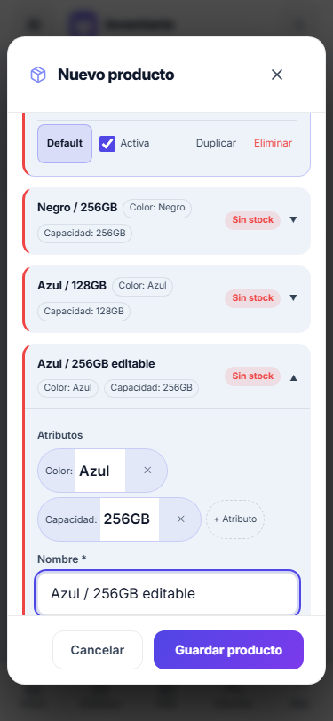
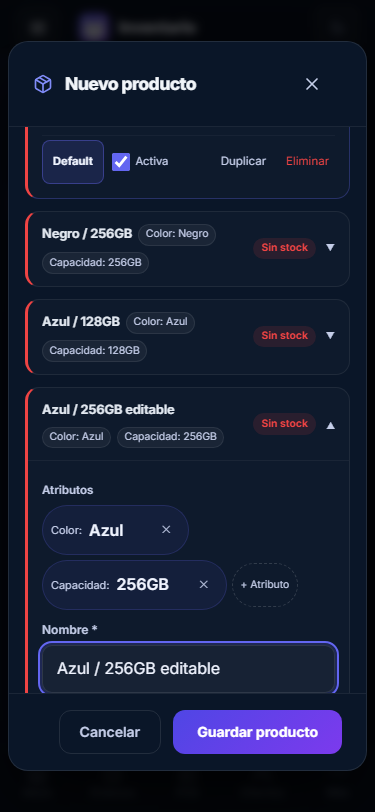

# PRODUCT-VARIANTS-1 — Variantes V2 seguras

Branch: `codex/product-variants-v2`. Base solicitada: `6ef066d5bc3e28ed56e94c1587be584c48f7e0a0`.
El PR y su SHA final se informan en la entrega. Sin merge, despliegue, `db push` ni cambios en producción.

## Discovery y alcance

Se reutilizaron ProductFormModal, VariantSelector, productService y el generador existente. Se leyeron la autoridad de Product Design y sus referencias de contexto, sistema visual, seguridad de ingeniería y calidad. POS mantiene su diseño protegido; Mi Guita no se usa como referencia.

El catálogo local y las migraciones confirman `inventory.parent_id`, `has_variants`, `variant_name`, `product_variants.product_id` y `inventory_item_id`. El esquema de variantes ya tenía RLS pero **ningún permiso de API para authenticated**. El alta real reprodujo `permission denied for table product_variants`; por eso la migración acotada es indispensable.

## Modelo y stock

- Padre: `inventory.has_variants=true`, `parent_id=null`, saldo cero. Agrupa y sirve para buscar; no se vende ni recibe ajustes propios. Su suma de hijos es sólo presentación.
- Hijo: inventario independiente con `parent_id=padre.id`, `has_variants=false`, nombre de variante, SKU, barcode, costos, precios, moneda, cotización, ubicación, mínimo y estado propios.
- Metadata: `product_variants.product_id` y `inventory_item_id` enlazan la familia y su hijo; conservan atributos, default y orden.
- Única autoridad de saldo: **inventory.stock_quantity**, mediante A1 para stock no documental y writers canónicos para documentos. No se modificaron A1/A3 ni sus writers, grants de stock o libro append-only.
- `product_variants.stock` queda deprecated: altas por su default cero, sin permisos de lectura/escritura de API. Selector y picker consultan el inventario vinculado. Un valor histórico en esa columna nunca decide disponibilidad.

## Alta, rollback y recuperación

Primero se valida la familia y se crean todas las definiciones sin campos de stock. Luego se intenta un solo batch `initial_stock`, con IDs de hijos, deltas y clave `initial-stock:<padre>`.

Antes del batch se limpian únicamente los IDs creados por ese intento. Si la política existente no permite borrado físico, las filas retenidas se desactivan por las capacidades existentes; no se amplían permisos de borrado de inventario. Después de intentar el batch no se ejecuta cleanup destructivo, aunque se pierda la respuesta.

La recuperación conserva padre, hijos, deltas, motivo y la misma clave; retry sólo ejecuta A1. El formulario congela metadata y bloquea doble submit con una referencia síncrona. Guarda recuperación y valores visibles en sessionStorage por negocio, y puede reabrirse en la misma sesión sin recrear la familia. El alta posterior de un hijo también conserva un retry propio con `initial-stock:<hijo>`.

Mensaje: “El producto y sus variantes se crearon, pero no pudimos confirmar el stock inicial. Reintentar no duplica el producto.”

## Superficies

| Superficie | Comportamiento |
| --- | --- |
| Inventario | Menú Producto / Servicio / Con variantes; padre expandible y total visual de hijos activos; acciones de edición, movimientos, alta y baja lógica por hijo; reactivación explícita. Duplicar V2 crea vínculos nuevos y saldo cero. |
| POS | Conserva búsqueda canónica, padre → hijos, SKU exacto, rechazo de padre y compatibilidad `parent_id`, `variant_parent:` y `VPREF-`. La venta descuenta el hijo seleccionado. Sin cambios visuales en POS. |
| Órdenes | Mismo contrato de búsqueda y selección vendible; etiqueta familia/variante e ID del hijo en `order_items.product_id`. |
| Mayorista | Excluye padres marcados; muestra identidad de variante y conserva ambos aliases de precio (`wholesale_price_ars` y `precio_mayorista`). Portal conserva stock positivo y visibilidad existentes. No cambia su writer de pedidos. |
| USD | Referencia de venta USD en `base_price`, costo USD separado, cotización y actualización automática por hijo; padre sin repricing automático. Una variante USD puede heredar costo ARS por conversión. Overrides y ceros explícitos se conservan. |
| Generador | Dimensiones completas y únicas, valores deduplicados, máximo 100 combinaciones; combina con filas manuales sin reemplazar ediciones. Se pueden editar nombres, SKU, atributos y valores propios. |
| Valores base | Reutiliza applyBaseToVariants para completar huecos sin pisar cambios individuales; conversiones con cotización válida, mínimo y ubicación heredables. |
| Mobile / temas | 375 px, filas de campos en una columna, textos largos sin desbordar, controles/touch targets de 44 px, foco visible y selector con Escape, ciclo de Tab y restauración de foco. CTA principal usa el token AA vigente. |

## Migración preparada

`supabase/migrations/20261014120000_product_variants_v2_metadata_access.sql`:

- No DML, backfill ni reconciliación de historia.
- Permisos por columna y tenant/capacidad; costos crudos y stock legado fuera de SELECT.
- Vínculo único de metadata por hijo; rechaza huérfanos, inventario no vinculado y relaciones entre negocios. Links/tenant no son editables por API.
- Padre V2 nuevo siempre raíz y saldo cero; no se puede quitar su identidad agrupadora para venderlo.
- Guard histórico contra borrado físico de metadata con stock/movimientos, conservando el purge canónico del tenant.
- Padres históricos con saldos previos pueden editar metadata sin reparación automática ni movimiento de stock.
- Requiere A1 y A3. Aborta si hay vínculos duplicados, sin corregirlos automáticamente.

**Debe aplicarse por el proceso autorizado antes del frontend productivo. Aquí sólo se probó en un contenedor local.** Ese contenedor estaba atrasado y se completaron allí las migraciones de stock existentes de G2-B a A3; no se aplicaron migraciones ARCA/MP ni se accedió a producción. La fecha/version del archivo se ubica después de la última migración de la base solicitada para evitar colisiones del ledger.

## Validación

| Verificación | Resultado local |
| --- | --- |
| Componentes: suite product-variants-v2 equivalente (4 archivos) | 69 passed: familia con 3 hijos, batch único, respuesta perdida/replay, rollback, doble submit, recuperación tras reabrir, validaciones, edición/alta/baja/reactivación, ARS/USD, herencia, simples/servicios y búsqueda legacy. |
| Nuevo E2E variants V2 | 3 passed: alta UI 3/5/2, venta Negro → 2, orden Azul → 4, Rosa 2 y padre 0; generador y mobile en light/dark. |
| search-variantes.spec.ts sin modificar | 11 passed; padre estructural, legacy, SKU, tenant y débito del hijo correctos. |
| SQL product_variants_v2.test.sql | Passed; permisos, links, tenant, stock canónico, replay, batch con padre rechazado atómicamente, baja lógica e historial, purge. BEGIN/ROLLBACK. |
| SQL G2-C.3A1 / G2-C.3A3 / SEC-08B | Passed. BEGIN/ROLLBACK. |
| Concurrencia A1 C1–C5 | 547 aserciones, 0 fallas; locks, replay, checkout/orden y saldo/libro coherentes. |
| A3 por PostgREST | 30 verificaciones passed; stock/libro directos cerrados, metadata y A1 operativos. |
| Guards | Variantes (14 mutantes), A2 (38 mutantes + 10 controles), A1, A3 (92 mutantes), SEC-08B (47 mutantes), búsqueda canónica. Sin mutantes retenidos. |
| TypeScript, lint:errors, build E2E, diff whitespace | Passed. |

Los 14 controles nuevos detectan: stock directo, venta de padre, débito de padre, cambio de clave y recreación en retry, lectura de stock legado, metadata huérfana, padre no marcado, hijo sin vínculo, SKU duplicado, ocultación del flujo, doble submit, ajuste de padre y padre ofrecido en Mayorista.

CI agrega la suite de componentes y la matriz SQL; m7-local incluye los nuevos E2E. Los jobs que arrancan deliberadamente antes de A3 apartan esta migración para conservar sus precondiciones originales. El estado remoto del CI se informa en la entrega, sin confundir pruebas locales con jobs terminados.

## Evidencia visual

Capturas revisadas, viewport 375 × 812, después de generar y editar combinaciones:

## Archivos

- Producto: `src/services/productService.ts`, `src/components/products/ProductFormModal.tsx`, `VariantSelector.tsx`, `product-variants.css`.
- Integraciones: `src/pages/Inventory.tsx`, `src/hooks/useInventory.ts`, `src/components/order/ModalAgregarItem.tsx`, `src/pages/Mayorista.tsx`, `src/portal/services/portalService.ts`, `src/portal/types.ts`.
- Guards: `scripts/guards/product-variants-v2.mjs`, `g2c3a2-frontend-stock-authority.mjs`.
- Tests: `tests/components/productVariantsV2.test.tsx`, los dos tests G2-C.3A2 existentes, `tests/components/fakes/supabaseStockFake.ts`, `tests/e2e/m7/product-variants-v2.spec.ts`, `tests/sql/product_variants_v2.test.sql`.
- Entrega/CI: migración indicada, `package.json`, `.github/workflows/ci.yml`, este informe y sus dos capturas.

## Hallazgos y límites

- El node_modules compartido local contiene dos instalaciones de Vitest: el wrapper npm apunta a `.deno/...`, mientras los tests importan la copia raíz. Eso produce matchers Chai inválidos al usar ese wrapper; el mismo conjunto pasa al invocar directamente la copia raíz con Node. No se modificaron dependencias ni lockfile. CI instala con npm ci.
- `lint:ci` con máximo 100 advertencias no pasa: 496 warnings y 0 errores. El gate vigente de CI es `lint:errors`, que pasa. Se conserva esta deuda general fuera del lote.
- React emite avisos act en algunos tests de formularios; sin fallas. Vite conserva el aviso de tamaño de chunks. El build E2E no configura el contacto de soporte productivo.
- La recuperación de stock persiste dentro de la sesión de navegador. Las definiciones y movimientos reales permanecen en base aun si se cierra la sesión.
- No se migraron ni repararon familias legadas. No se modificaron ARCA, Mercado Pago, BUTTON-SYSTEM-1A ni políticas de stock/costo para resolver este flujo.
